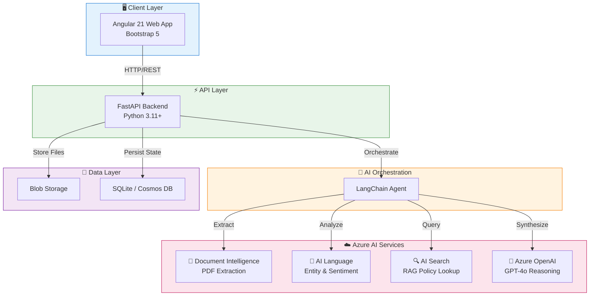

# AI Loan Processing Engine

**Intelligent Small Business Loan Automation with Azure AI**


## 🚀 Overview
The **AI Loan Processing Engine** is a portfolio project demonstrating advanced cloud-native AI engineering skills (aligned with **Microsoft Certified: Azure AI Engineer Associate**).

It acts as a virtual loan officer that:
1.  **Interviews** applicants via a natural language chat.
2.  **Analyzes** uploaded financial documents (PDFs) using **Azure Document Intelligence**.
3.  **Validates** eligibility against complex internal policies using **Azure AI Search** (RAG).
4.  **Decides** on pre-qualification using **Azure OpenAI (GPT-4)**.

## 🏗 Architecture

The system is built using a microservices approach:



> 📖 *See [docs/architecture.md](docs/architecture.md) for detailed component descriptions*

## 🛠 Tech Stack
- **Cloud:** Microsoft Azure
- **AI Services:**
  - **Azure OpenAI:** GPT-4o for reasoning and conversation.
  - **Azure Document Intelligence:** Extracting data from Bank Statements/Invoices.
  - **Azure AI Search:** Vector-based knowledge retrieval for policy documents.
  - **Azure AI Language:** Sentiment analysis and entity extraction.
- **Backend:** Python, FastAPI, Pydantic.
- **Frontend:** Angular, TypeScript, RxJS.

## 📂 Project Structure
```
ai-loan-processing-engine/
├── backend/           # Python FastAPI Application
├── frontend/          # Angular Web Application
├── docs/              # Documentation & Design
└── README.md          # You are here
```

## 🚦 Getting Started

### Prerequisites
- Azure Subscription (Free Tier works)
- Python 3.11+
- Node.js 18+
- npm 9+

### Installation

```bash
# Clone the repository
git clone https://github.com/rajeswarandhandapani/ai-loan-processing-engine.git
cd ai-loan-processing-engine
```

### 🔧 Backend Setup

```bash
# Navigate to backend directory
cd backend

# Create virtual environment
python -m venv .venv

# Activate virtual environment
source .venv/bin/activate        # Linux/Mac
# .venv\Scripts\activate         # Windows

# Install dependencies
pip install -r requirements.txt

# Configure environment variables
cp .env.example .env
# Edit .env with your Azure credentials

# Start the backend server
uvicorn app.main:app --reload --port 8000
```

> 🌐 Backend API will be available at: `http://localhost:8000`  
> 📚 API Docs (Swagger): `http://localhost:8000/docs`

### 🎨 Frontend Setup

```bash
# Navigate to frontend directory (from project root)
cd frontend

# Install dependencies
npm install

# Start the development server
npm start
```

> 🌐 Frontend will be available at: `http://localhost:4200`

### 🚀 Quick Start (Both Services)

```bash
# Terminal 1 - Backend
cd backend && source .venv/bin/activate && uvicorn app.main:app --reload --port 8000

# Terminal 2 - Frontend
cd frontend && npm start
```

### Azure Configuration

Follow the [Azure Manual Setup Guide](docs/azure-manual-setup.md) to provision required Azure resources and configure your `.env` file.

## 📅 Development Plan
This project is being built over 4 weeks. See the [Implementation Plan](docs/implementation-plan.md) for details.

---
*Created by [Rajeswaran Dhandapani](https://rajeswarandhandapani.com)*
