# AI Loan Processing Engine

**Intelligent Small Business Loan Automation with Azure AI**


## 🚀 Overview
The **AI Loan Processing Engine** is a portfolio project demonstrating advanced cloud-native AI engineering skills (aligned with **Microsoft Certified: Azure AI Engineer Associate**).

It acts as a virtual loan officer that:
1.  **Interviews** applicants via a natural language chat.
2.  **Analyzes** uploaded financial documents (PDFs) using **Azure Document Intelligence**.
3.  **Validates** eligibility against complex internal policies using **Azure AI Search** (RAG).
4.  **Decides** on pre-qualification using **Azure OpenAI (GPT-4)**.

## 📸 Screenshots

### Main Interface

*Two-column layout with AI Chat Assistant and Document Upload*

### Document Analysis

*Automatic extraction of financial data from uploaded documents*

### Chat Conversation

*Natural language conversation with the AI Loan Officer*

> 📷 *To add screenshots: Take screenshots and save them in `docs/screenshots/`*

## ✨ Key Features

| Feature | Description | Azure Service |
|---------|-------------|---------------|
| **Document Intelligence** | Extract data from bank statements, invoices, receipts, tax forms | Azure Document Intelligence |
| **AI Chat Assistant** | Natural language conversation with context awareness | Azure OpenAI + LangChain |
| **Policy RAG Search** | Query lending policies using vector similarity search | Azure AI Search |
| **Sentiment Analysis** | Detect user emotions for empathetic responses | Azure AI Language |
| **Entity Extraction** | Identify loan amounts, business types, dates automatically | Azure AI Language |
| **Session Management** | Maintain conversation context across multiple messages | LangGraph Memory |

## 🎬 Demo Workflow

1. **Upload Documents** - Drag & drop financial documents (PDF, images)
2. **AI Extracts Data** - Document Intelligence parses and extracts key fields
3. **Ask Questions** - Chat with the AI about your loan application
4. **Get Answers** - AI references your documents and lending policies
5. **Receive Decision** - Get pre-qualification assessment based on policies

## 🏗 Architecture

The system is built using a microservices approach:

```mermaid
flowchart TB
    subgraph Client["🖥️ Frontend - Angular 19"]
        Upload["📤 Document Upload<br/>Drag & Drop"]
        Chat["💬 Chat Interface<br/>Real-time Messaging"]
    end

    subgraph API["⚡ Backend - FastAPI"]
        DocRouter["Document Router<br/>/api/v1/documents"]
        ChatRouter["Chat Router<br/>/api/v1/chat"]
        SessionStore["Session Store<br/>Document Context"]
    end

    subgraph Agent["🤖 LangChain Agent"]
        LangGraph["LangGraph<br/>Conversation Memory"]
        Tools["Agent Tools"]
    end

    subgraph Foundry["☁️ Azure AI Foundry"]
        OpenAI["🧠 Azure OpenAI<br/>GPT-4o"]
        Anthropic["🤖 Anthropic<br/>Claude"]
        Embeddings["📊 Embeddings<br/>text-embedding-ada-002"]
    end

    subgraph Azure["☁️ Azure AI Services"]
        DI["📄 Document Intelligence<br/>Bank Statements, Invoices"]
        Lang["💬 AI Language<br/>Sentiment & Entities"]
        Search["🔍 AI Search<br/>RAG Vector Search"]
    end

    Upload -->|POST /upload| DocRouter
    Chat -->|POST /chat| ChatRouter
    DocRouter -->|Analyze| DI
    DocRouter -->|Store| SessionStore
    ChatRouter -->|Invoke| LangGraph
    LangGraph -->|Execute| Tools
    Tools -->|"search_lending_policy"| Search
    Tools -->|"get_documents"| SessionStore
    Tools -->|"analyze_sentiment"| Lang
    Tools -->|"extract_entities"| Lang
    LangGraph -->|Generate Response| OpenAI
    LangGraph -.->|Alternate LLM| Anthropic
    Search -->|Vector Query| Embeddings

    style Client fill:#e0f2f1,stroke:#00897b
    style API fill:#e8f5e9,stroke:#388e3c
    style Agent fill:#fff3e0,stroke:#f57c00
    style Foundry fill:#e3f2fd,stroke:#1976d2
    style Azure fill:#fce4ec,stroke:#c2185b
```



> 📖 *See [docs/architecture.md](docs/architecture.md) for detailed component descriptions*

## 🛠 Tech Stack
- **Cloud:** Microsoft Azure
- **LLM Providers:**
  - **Azure OpenAI:** GPT-4o for reasoning and conversation.
  - **Anthropic:** Claude as alternate LLM provider.
- **AI Services:**
  - **Azure Document Intelligence:** Extracting data from Bank Statements/Invoices.
  - **Azure AI Search:** Vector-based knowledge retrieval for policy documents.
  - **Azure AI Language:** Sentiment analysis and entity extraction.
- **Backend:** Python, FastAPI, Pydantic.
- **Frontend:** Angular, TypeScript, RxJS.

## 📂 Project Structure
```
ai-loan-processing-engine/
├── backend/           # Python FastAPI Application
├── frontend/          # Angular Web Application
├── docs/              # Documentation & Design
└── README.md          # You are here
```

## 🚦 Getting Started

### Prerequisites
- Azure Subscription (Free Tier works)
- Python 3.11+
- Node.js 18+
- npm 9+

### Installation

```bash
# Clone the repository
git clone https://github.com/rajeswarandhandapani/ai-loan-processing-engine.git
cd ai-loan-processing-engine
```

### 🔧 Backend Setup

```bash
# Navigate to backend directory
cd backend

# Create virtual environment
python -m venv .venv

# Activate virtual environment
source .venv/bin/activate        # Linux/Mac
# .venv\Scripts\activate         # Windows

# Install dependencies
pip install -r requirements.txt

# Configure environment variables
cp .env.example .env
# Edit .env with your Azure credentials

# Start the backend server
uvicorn app.main:app --reload --port 8000
```

> 🌐 Backend API will be available at: `http://localhost:8000`  
> 📚 API Docs (Swagger): `http://localhost:8000/docs`

### 🎨 Frontend Setup

```bash
# Navigate to frontend directory (from project root)
cd frontend

# Install dependencies
npm install

# Start the development server
npm start
```

> 🌐 Frontend will be available at: `http://localhost:4200`

### 🚀 Quick Start (Both Services)

```bash
# Terminal 1 - Backend
cd backend && source .venv/bin/activate && uvicorn app.main:app --reload --port 8000

# Terminal 2 - Frontend
cd frontend && npm start
```

### Azure Configuration

Follow the [Azure Manual Setup Guide](docs/azure-manual-setup.md) to provision required Azure resources and configure your `.env` file.

## 📅 Development Plan
This project is being built over 4 weeks. See the [Implementation Plan](docs/implementation-plan.md) for details.

---
*Created by [Rajeswaran Dhandapani](https://rajeswarandhandapani.com)*
