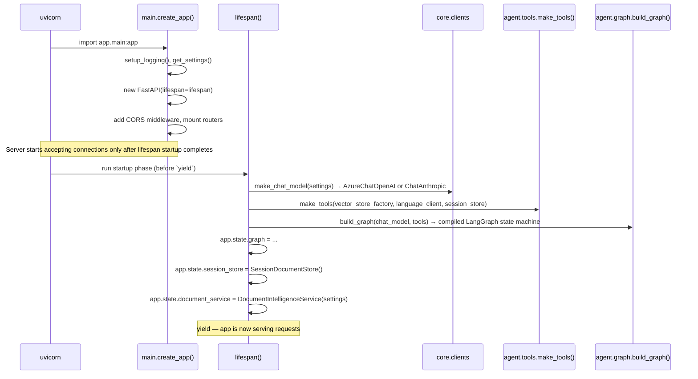
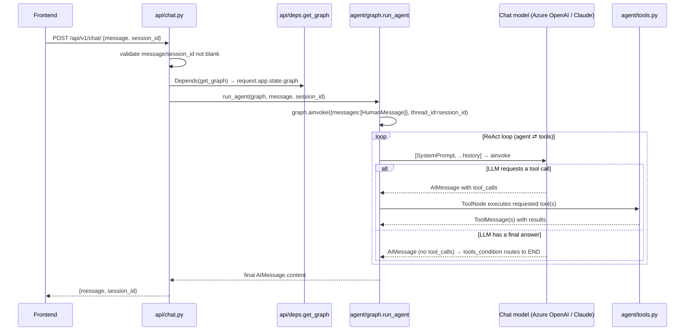
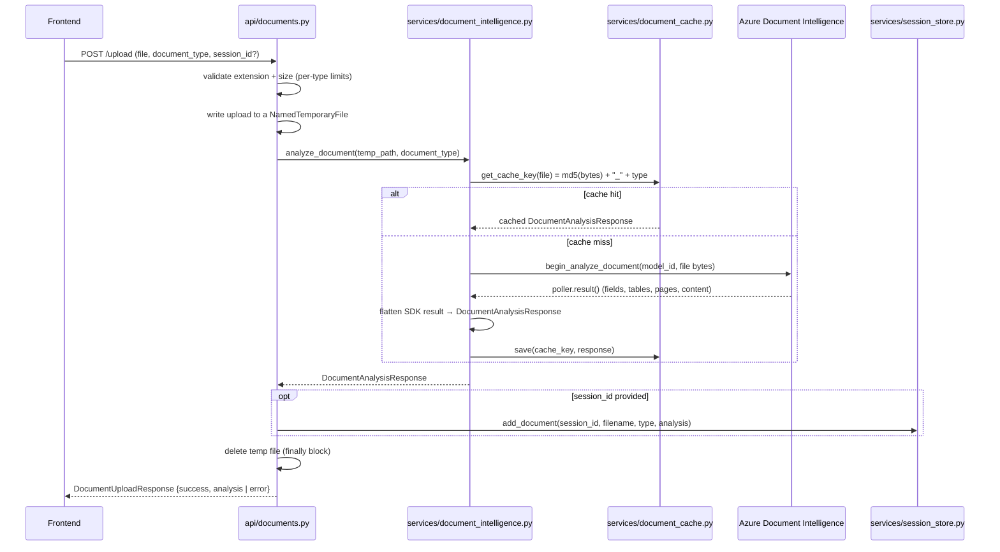
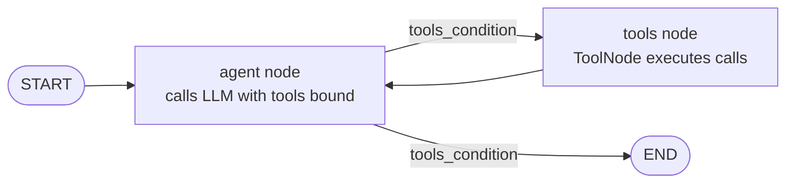

# Backend Guide (for Java Developers)

This explains how the `backend/` service actually works today — file by file,
library by library — framed with Java/Spring analogies. It complements
[`architecture.md`](architecture.md) (which describes the intended high-level
design) by documenting the real, current code.

> Note: `architecture.md` mentions SQLite/Cosmos DB and Blob Storage — those
> aren't implemented. Today there's no database; session data lives in an
> in-memory dict, and uploaded files are written to a temp file and deleted
> right after analysis. Treat this doc as the source of truth for "what's
> actually there."

---

## 1. The 60-second mental model

| Java / Spring world | This project | Notes |
|---|---|---|
| Spring Boot app | FastAPI app (`app/main.py`) | `create_app()` is like a `@SpringBootApplication` + manual `@Bean` wiring |
| `@RestController` | `APIRouter` (`app/api/chat.py`, `documents.py`) | One router per resource, mounted with a prefix |
| `@Autowired` / `ApplicationContext` | `Depends(...)` + `app.state` | No DI container — dependencies are built once at startup and handed out via `Depends` functions in `app/api/deps.py` |
| DTOs / `record` classes | Pydantic `BaseModel`s (`app/models.py`) | Validated automatically on request parse; also used for internal data shapes |
| `application.yml` + `@ConfigurationProperties` | `.env` + `Settings(BaseSettings)` (`app/core/config.py`) | Pydantic reads env vars into a typed, validated object |
| `@Bean` factory methods | Plain factory functions (`app/core/clients.py`) | e.g. `make_chat_model(settings)` returns a configured LLM client |
| Maven/Gradle + `pom.xml`/`build.gradle` | `uv` + `pyproject.toml` | `uv` is a fast Python package manager; `uv.lock` is the lockfile (like `pom.xml` + resolved dependency tree) |
| JUnit | `pytest` | Tests in `backend/tests/`, fixtures in `conftest.py` |
| Checkstyle/SpotBugs | `ruff` | Linter + formatter, config lives in `pyproject.toml` |
| Spring State Machine / a workflow engine | **LangGraph** (`app/agent/graph.py`) | A small, explicit state machine that runs the AI agent's "think → call tool → think again" loop |
| A `WebClient`/`RestTemplate` wrapper around an LLM API | **LangChain** (`langchain-openai`, `langchain-anthropic`) | Provides a common `BaseChatModel` interface over Azure OpenAI or Anthropic, plus the `@tool` decorator for turning Python functions into LLM-callable "functions" |

Biggest conceptual difference from Spring: **there's no DI framework**. Instead
of annotations and reflection, the code just calls functions and passes the
results around. Everything expensive (LLM client, vector store, compiled
graph) is built exactly once in `lifespan()` (main.py) and stashed on
`app.state`, similar to storing singleton beans in the Spring
`ApplicationContext`.

---

## 2. Repository layout

```
backend/
├── app/
│   ├── main.py                  # FastAPI app factory + startup/shutdown wiring
│   ├── models.py                # Pydantic request/response schemas
│   ├── core/
│   │   ├── config.py            # Settings (reads .env), typed & validated
│   │   ├── clients.py           # Factories for Azure/LLM clients
│   │   ├── errors.py            # friendly_error() + @tool_errors decorator
│   │   └── logging.py           # Console + rotating-file logging setup
│   ├── api/
│   │   ├── chat.py               # POST /api/v1/chat/
│   │   ├── documents.py          # POST /api/v1/documents/upload, GET /types
│   │   └── deps.py               # Depends()-style accessors into app.state
│   ├── agent/
│   │   ├── graph.py              # LangGraph state machine (the ReAct loop)
│   │   ├── tools.py              # The 4 tools the LLM can call
│   │   └── prompts/
│   │       └── loan_officer_system_prompt.md   # The agent's system prompt
│   └── services/
│       ├── document_intelligence.py  # Azure Document Intelligence wrapper
│       ├── document_cache.py         # Disk cache for DI results (by file hash)
│       └── session_store.py          # In-memory per-session document storage
├── scripts/
│   ├── index_lending_policy.py  # One-off: embeds & indexes the policy PDF into Azure AI Search
│   ├── document_intelligence.py # CLI helper for testing DI extraction
│   └── chat_client.py           # CLI chat client for manual testing
├── tests/
│   ├── conftest.py              # Shared fixtures (fake LLM, etc.)
│   ├── test_api.py              # HTTP-level tests (TestClient + dependency overrides)
│   ├── test_graph.py             # Agent/graph behavior tests
│   └── test_tools.py             # Tool unit tests
├── pyproject.toml               # Dependencies, tool config (ruff, pytest) — like pom.xml
├── uv.lock                      # Resolved/pinned dependency versions — like a lockfile
└── .env.example                 # Documents every environment variable
```

---

## 3. Python things a Java developer will trip over

These are used pervasively in this codebase, so it's worth naming them:

- **Type hints are not enforced by the runtime.** `def foo(x: int) -> str:` is
  a hint for humans/tools (and Pydantic *does* enforce them on its models),
  but plain functions won't throw a `ClassCastException` if you pass the
  wrong type. `ruff` and IDEs catch mismatches statically, not the interpreter.
- **Decorators (`@something`) are Python's annotations**, but they actually
  *wrap* the function rather than just tag it for reflection. E.g. `@tool` in
  `app/agent/tools.py` takes a plain function and turns it into a LangChain
  `BaseTool` object (auto-generating a JSON schema for its arguments from the
  type hints and docstring). `@tool_errors` (in `app/core/errors.py`) wraps a
  function in a try/except so it can never raise — closer to a Spring
  `@Around` advice than a Java annotation.
- **`async def` / `await`** is used throughout (`app/main.py`, `api/*.py`,
  `agent/graph.py`). This is cooperative single-thread concurrency, like
  Project Reactor/`Mono`/`Flux` or `CompletableFuture` chains, not OS threads.
  Uvicorn (the ASGI server) drives an event loop; `await` yields control while
  waiting on I/O (HTTP calls to Azure, etc.).
- **Closures instead of a DI container.** `make_tools(...)` in
  `app/agent/tools.py` is a function that takes dependencies as parameters and
  defines the actual tool functions *inside* it — those inner functions close
  over (capture) `language_client`, `session_store`, etc. This is the
  project's stand-in for constructor injection.
- **`dataclass`** (`SessionDocument` in `session_store.py`) is a lighter-weight
  cousin of Pydantic's `BaseModel` — like a Lombok `@Data` class: no
  validation, just a plain typed container with generated `__init__`.
- **`StrEnum`** (`DocumentType` in `models.py`) behaves like a Java enum whose
  constants also *are* strings — `DocumentType.INVOICE == "invoice"` is `True`.
- **Context managers (`with`/`@asynccontextmanager`)** are like
  try-with-resources. `lifespan()` in `main.py` is an async context manager:
  code before `yield` runs on startup, code after `yield` runs on shutdown —
  this is where the singleton-style objects get built once.
- **`functools.lru_cache`** on `get_settings()` memoizes the return value —
  effectively a manual singleton (`.env` is parsed once, cached forever).

---

## 4. Key libraries, and what each one is doing here

| Library | Role in this project |
|---|---|
| **FastAPI** | The web framework. Declares routes (`APIRouter`), validates request/response bodies via Pydantic models, and generates OpenAPI docs automatically at `/docs`. |
| **Uvicorn** | The ASGI server that actually runs the app (like Tomcat/Jetty for a Spring app). Started via `uvicorn.run("app.main:app", ...)` in `main.py`'s `__main__` block, or by an external `uvicorn` CLI/process manager in production. |
| **Pydantic v2 / pydantic-settings** | Data validation and settings management. `app/models.py` defines API schemas; `app/core/config.py`'s `Settings` reads and validates environment variables. |
| **python-multipart** | Required by FastAPI under the hood to parse `multipart/form-data` (file uploads in `documents.py`). |
| **LangChain** (`langchain`, `langchain-openai`, `langchain-anthropic`, `langchain-community`) | Provides: (1) a common `BaseChatModel` interface so the code doesn't care whether it's talking to Azure OpenAI or Anthropic Claude, (2) the `@tool` decorator that turns Python functions into LLM-callable tools, (3) `AzureSearch`, a vector-store wrapper for RAG retrieval. |
| **LangGraph** | A small graph/state-machine library for building agent control flow explicitly (nodes + edges) instead of a hidden "agent executor" loop. Used in `app/agent/graph.py` to build the ReAct loop, and provides `InMemorySaver`, the checkpointer that gives each chat session its own conversation memory. |
| **azure-ai-documentintelligence** | Talks to Azure Document Intelligence (OCR + structured extraction: bank statements, invoices, receipts, W2s). Wrapped by `services/document_intelligence.py`. |
| **azure-ai-textanalytics** | Azure AI Language SDK — sentiment analysis and named-entity recognition. Used directly inside two of the agent's tools (`analyze_user_sentiment`, `extract_entities`). |
| **azure-search-documents** | Azure AI Search SDK — used both by `scripts/index_lending_policy.py` (to build the index) and transitively by LangChain's `AzureSearch` vector store (to query it). |
| **azure-core / azure-identity** | Shared Azure SDK plumbing (`AzureKeyCredential`, HTTP error types); `azure-identity` is pulled in because `langchain-community`'s `AzureSearch` builder imports it, even though this project only uses key-based auth. |
| **pytest / pytest-asyncio** | Test runner; `asyncio_mode = "auto"` (see `pyproject.toml`) means `async def test_...()` functions just work without extra decorators. |
| **httpx** (dev dependency) | Used by FastAPI's `TestClient` under the hood for in-process HTTP calls in tests. |
| **ruff** | Linter + formatter (replaces the roles of Checkstyle/PMD/spotless in one fast tool). |
| **uv** | Project/dependency manager (replaces `pip` + `venv` + a chunk of what Maven/Gradle do): resolves and locks dependencies into `uv.lock`, manages the `.venv`, and runs commands with `uv run`. |

---

## 5. How the pieces connect: startup sequence

Everything begins in [`app/main.py`](../backend/app/main.py). Reading it top
to bottom mirrors a Spring Boot startup log:



Key design point (see the module docstring in `main.py`): **nothing touches
Azure at import time.** All clients are constructed inside `lifespan()`, which
only runs when the app actually starts (not when a test merely imports the
module). This is why `tests/test_api.py` can call `create_app()` directly and
override `app.dependency_overrides[...]` with stubs, without ever needing real
Azure credentials.

The Azure AI Search vector store is built even *lazier* than that: `make_tools`
receives a `vector_store_factory` (a zero-arg function) rather than an
already-built store, and only calls it the first time
`search_lending_policy` actually runs (see the `cached` dict closure in
`app/agent/tools.py`). So a missing/invalid Azure Search config won't break
startup — only that one tool call.

---

## 6. Request lifecycle #1: `POST /api/v1/chat/`



Notable details:
- `session_id` becomes the LangGraph **`thread_id`**. The `InMemorySaver`
  checkpointer (set up in `build_graph`) uses that key to keep each
  conversation's message history separate — this is the *only* thing giving
  the chat "memory" across turns. It's in-memory and per-process: restart the
  server (or run multiple workers) and history is gone/inconsistent. That's
  an explicit tradeoff, documented in the `session_store.py` docstring for the
  document store too.
- `run_agent` wraps the whole turn in a 90-second `asyncio.wait_for` timeout
  (`AGENT_TIMEOUT_SECONDS` in `graph.py`) so a stuck tool-call loop can't hang
  a request forever.
- Any exception is turned into a generic, non-leaky message by
  `friendly_error()` (`core/errors.py`) before it reaches the HTTP response —
  the real exception is only in the server logs (`logger.exception(...)`).

---

## 7. Request lifecycle #2: `POST /api/v1/documents/upload`



Two things worth calling out for a Java developer:
- **Failures are reported as HTTP 200** with `success: false` in the body
  (see the comment in `documents.py`: "frontend contract"), not as a 4xx/5xx —
  a deliberate API design choice, not an oversight. Validation errors (bad
  extension, oversized file) *do* still raise proper `HTTPException`s before
  analysis starts.
- The **document cache** (`document_cache.py`) is a plain JSON-file-per-hash
  cache on local disk (`.cache/document_intelligence/`), purely to avoid
  paying for/re-waiting-on Azure calls during development when re-uploading
  the same sample files. It's not a production cache (no eviction, no TTL,
  not shared across instances).

---

## 8. The agent itself: LangGraph deep dive

`app/agent/graph.py` builds this graph:



This is a hand-rolled **ReAct loop** (Reason + Act): the `agent` node asks the
LLM "given the conversation so far, what's next?"; if the LLM's answer
includes tool calls, `tools_condition` (a LangGraph prebuilt) routes to the
`tools` node, which executes them and appends the results as `ToolMessage`s;
control returns to `agent`, which sees the tool output and decides whether to
call another tool or produce a final answer. If Java/Spring State Machine is
familiar: `agent` and `tools` are states, `tools_condition` is a guarded
transition.

The **4 tools** (`app/agent/tools.py`), each built with LangChain's `@tool`
decorator and wrapped with `@tool_errors` so they return `{"error": ...}`
instead of raising:

| Tool | Backed by | Purpose |
|---|---|---|
| `search_lending_policy` | Azure AI Search (`AzureSearch` vector store) | RAG: semantic search over the indexed lending-policy PDF |
| `analyze_user_sentiment` | Azure AI Language | Detect if the user sounds frustrated/happy, for a more empathetic reply |
| `extract_entities` | Azure AI Language | Pull structured entities (money, org, date...) out of free text |
| `get_analyzed_financial_documents_from_session` | `SessionDocumentStore` (in-memory) | Returns everything the user has uploaded+analyzed *this session*, so the agent can reason about their financials |

The **tool names are a contract with the system prompt** — the prompt in
`app/agent/prompts/loan_officer_system_prompt.md` explicitly instructs the
model when to call each one by name (e.g. "ALWAYS use `search_lending_policy`
... NEVER answer from memory"). If you rename a tool function, you must also
update the prompt text, or the model's instructions silently stop matching
reality.

`get_analyzed_financial_documents_from_session` is the one tool with a
`ToolRuntime` parameter — LangGraph injects this automatically (it's not
something the LLM fills in) and gives the tool access to
`runtime.config["configurable"]["thread_id"]`, i.e. the current session_id —
this is how a tool "knows" which conversation it's running inside without the
LLM having to pass it.

The **system prompt** (`loan_officer_system_prompt.md`) is a large, carefully
engineered prompt — it's essentially the agent's "business logic" written in
English rather than Python: conversation-flow rules, a decision framework
(pre-approved/conditional/rejected), formatting rules, and explicit
compliance boundaries (never recommend outside lenders). Changing agent
*behavior* often means editing this file, not the Python code.

---

## 9. Configuration

`app/core/config.py` defines one `Settings` class (pydantic-settings) that
reads `backend/.env` (see `.env.example` for the full annotated list — Azure
Document Intelligence, Azure OpenAI, Azure AI Search, Azure AI Language,
Anthropic, LangSmith tracing, and app-level toggles like `DEBUG` and the
document cache). It's read once and cached via `@lru_cache` in
`get_settings()` — analogous to a Spring `@ConfigurationProperties` bean that's
a singleton by default.

`LLM_PROVIDER` (`"azure"` or `"anthropic"`) is the one setting that changes
code path, not just a value — `make_chat_model()` in `core/clients.py`
branches on it to build either `AzureChatOpenAI` or `ChatAnthropic`, both
exposed through LangChain's common `BaseChatModel` interface so the rest of
the app (the graph, the tools) never needs to know which provider is active.

---

## 10. Error-handling philosophy

Two layers, both in `app/core/errors.py`:

- **`friendly_error(exc)`** — maps any exception to a short, generic
  user-facing string (timeout / rate-limited / connection / generic), never
  leaking internal details (stack traces, Azure error bodies) to the client.
  Used in the chat endpoint before raising `HTTPException`.
- **`@tool_errors`** — a decorator applied to every agent tool. Since tools
  run *inside* the LLM's reasoning loop, an unhandled exception there would
  crash the whole chat turn; instead every tool always returns a dict, with
  `{"error": ...}` on failure, so the LLM can see the failure and react
  ("that didn't work, let me try a different approach") instead of the whole
  request blowing up.

---

## 11. Testing & tooling

- **Run the app:** `cd backend && uv run uvicorn app.main:app --reload`
  (or `uv run python -m app.main`).
- **Run tests:** `cd backend && uv run pytest`
- **Lint:** `cd backend && uv run ruff check .`
- Tests never touch real Azure services:
  - `tests/conftest.py` provides `FakeToolModel`, a scripted stand-in for the
    LLM (`GenericFakeChatModel` from `langchain_core`, patched so
    `.bind_tools()` is a no-op) — you hand it a scripted list of `AIMessage`s
    and it plays them back in order, letting `test_graph.py` /
    `test_tools.py` assert on exact agent behavior deterministically.
  - `tests/test_api.py` calls `create_app()` directly (bypassing `uvicorn`)
    and overrides every `Depends(...)` (`get_graph`, `get_session_store`,
    `get_document_service`) with stub objects via
    `app.dependency_overrides[...]` — FastAPI's built-in equivalent of
    swapping in a `@MockBean` in a Spring `@WebMvcTest`.
- **`scripts/`** are standalone CLI utilities, not part of the served app:
  `index_lending_policy.py` (one-time: chunk + embed + upload the sample
  policy PDF into Azure AI Search), `document_intelligence.py` and
  `chat_client.py` (manual smoke-testing helpers).

---

## 12. Suggested reading order

If you want to trace one full mental "wire," read in this order:

1. `app/main.py` — see the whole app assembled
2. `app/core/config.py` → `app/core/clients.py` — what gets configured and built
3. `app/agent/tools.py` → `app/agent/prompts/loan_officer_system_prompt.md` — what the agent can *do*
4. `app/agent/graph.py` — how those tools get orchestrated
5. `app/api/chat.py` and `app/api/documents.py` — how HTTP requests reach all of the above
6. `tests/test_api.py` and `tests/conftest.py` — see it all exercised without any real Azure calls
